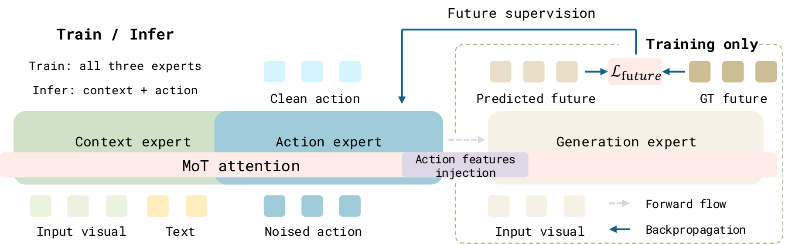

# Forward Dynamics Model

论文 **Forward Dynamics Model（FDM）** 的官方实现。

[🌐 项目主页](https://logosroboticsgroup.github.io/FDM/) · [English / 完整安装与运行说明](README.md)

## 项目网页

[项目主页](https://logosroboticsgroup.github.io/FDM/) 展示英文字幕 demo、架构比较、可切换训练／推理模式的 pipeline，以及五项任务、四种方法的真机视频对比（每段上方为 third view，下方为半尺寸左右腕部视角）。

本地预览：`python -m http.server 8000 --directory docs/website`，然后打开 `http://localhost:8000`。发布步骤及 PPT 视频导出说明见 [网页说明](docs/website/README.md)。

## ✨ 方法

FDM 通过“动作到未来”的单向依赖学习机器人策略：训练时，生成专家读取动作专家的隐藏特征，预测未来观测；未来预测损失沿这些特征反向传播，为动作学习提供监督。动作专家不能读取未来信息。推理时只保留当前观测的上下文处理和动作预测，省去未来生成的计算。

  

<em>训练时由未来预测监督动作特征；推理时仅保留上下文与动作专家。</em>

本仓库包含两种实现，并沿用 StarVLA 的 Python 包名：

| 论文模型 | 代码框架 | 骨干与未来监督 |
| --- | --- | --- |
| FDM w/ VLM | `Pi05Causal` | π₀.₅ / PaliGemma；回归未来图像的 Wan VAE latent |
| FDM w/ VGM | `WanMoTCausal` | Wan2.2-TI2V-5B；对未来视频 latent 进行 flow matching |

## 🏆 论文结果

以下为论文报告的成功率，并非本次代码发布重新测得的结果。

| 模型 | LIBERO 平均 | RoboTwin 2.0 Clean | Randomized | RoboTwin 平均 |
| --- | ---: | ---: | ---: | ---: |
| FDM w/ VLM | 99.4% | 81.54% | 80.86% | 81.20% |
| FDM w/ VGM | 98.1% | 88.84% | 89.62% | 89.23% |

真实机器人实验使用双臂 ARX-X5，覆盖五项操作任务。论文训练使用 8 张 H100，推理使用 1 张 H100。

## 🚀 使用入口

1. 按照 [英文 README](README.md#installation) 安装 Python 3.10、PyTorch 和源码依赖。
2. 准备 LeRobot 数据集，在对应数据注册文件中配置实际路径、相机和动作表示。
3. 准备 π₀.₅ / Wan 权重和 tokenizer；VGM 训练还需预计算文本 embedding。
4. 使用 [训练示例](README.md#training) 启动训练，按照 [评测说明](README.md#evaluation-and-inference) 启动策略服务和仿真客户端。

| 环境 | 数据与运行说明 |
| --- | --- |
| LIBERO | [指南](examples/LIBERO/README.md) |
| RoboTwin | [指南](examples/Robotwin/README.md) |
| ARX | [指南](examples/ARX/README.md) |

本次发布包含代码和配置模板，不包含数据集、训练 checkpoint、缓存或日志，尚未在此提供公开 FDM checkpoint 下载链接。部分模板默认值与论文设置不同；复现时应核对状态输入、动作维度、归一化、相机布局和训练配置，具体差异见英文 README。继承的指南可能涉及本次发布未包含的可选环境或本地测试。

## 🤝 引用与致谢

引用格式见 [Citation](README.md#citation)。本项目基于 StarVLA，并使用 OpenPI/RLinf、Wan、LeRobot、LIBERO 和 RoboTwin 的组件与工作流。[LICENSE](LICENSE) 标明 FDM 作者与贡献者版权，并保留上游 StarVLA 版权及许可条款，第三方声明见 [THIRD_PARTY_NOTICES.md](THIRD_PARTY_NOTICES.md)。
