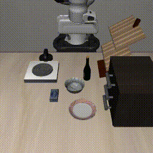

# 🚀 LIBERO Evaluation

This document provides instructions for reproducing our **experimental results** with LIBERO.  
The evaluation process consists of two main parts:  

1. Setting up the `LIBERO` environment and dependencies.  
2. Running the evaluation by launching services in both `starVLA` and `LIBERO` environments.  

We have verified that this workflow runs successfully on both **NVIDIA A100** and **RTX 4090** GPUs.  

> 💡 **AMD GPU Support:** Community members have verified that starVLA also works on **AMD Instinct MI300X** GPUs with ROCm 6.4 — with zero source code changes. The only modification needed is setting `--framework.qwenvl.attn_implementation sdpa`. For a detailed setup guide and benchmark results, see [Issue #254](https://github.com/starVLA/starVLA/issues/254).

---


## Current evaluation defaults

The existing LIBERO entry points now follow local FastWAM `7faa711` / `configs/sim_libero.yaml`:

| Setting | Default |
| --- | --- |
| Action steps, spatial / object / goal | 400 |
| Action steps, libero_10 / libero_90 | 700 |
| Initial no-op steps | 30 (in addition to the action budget) |
| Executed actions before replanning | 10 |
| Predicted action chunk | From the checkpoint (FastWAM default: 32) |
| Trials per task / seed | 50 / 42 |
| Denoising steps | 10 |
| Cameras | 256×256 render, rotate both views 180°, PIL bilinear crop/resize to 224×224 |
| Image transport | Lossless raw arrays |
| State / action normalization | FastWAM min/max; continuous 8D proprio; no clipping before action denormalization |
| Gripper | `sign(1 - 2 * open_value)` after denormalization |
| WanMoT sampling | Per-call seed, CPU float32 noise, then cast to model dtype/device |
| Server precision / compilation | BF16 / enabled |
| RTC / action ensemble / future-video visualization | Disabled |

`ACTION_HORIZON` retains its existing meaning: **execution length**, equivalent to FastWAM's
`replan_steps`, not its prediction horizon. `NUM_STEPS_WAIT`, `NUM_INFERENCE_STEPS`, `SEED`,
`NUM_TRIALS_PER_TASK`, and `COMPILE` override the defaults in the launch scripts.
The launch scripts also accept `TASK_ID` (zero-based; unset runs the suite), `PREDICTION_HORIZON`
(prediction length; unset uses the checkpoint), `SIGMA_SHIFT`, and `BINARIZE_GRIPPER=0`.
Their CLI equivalents are `--args.task-id`, `--args.prediction-horizon`, `--args.sigma-shift`, and
`--args.no-binarize-gripper`. `TASK_ID` and a positive `MAX_TASKS` are mutually exclusive.
Single-task runs write to a `task_<id>` subdirectory and a separate task log.
Prediction-length overrides are supported by the WanMoT family; other frameworks need their own support.
Default guidance is the existing action-only path (scale 1, no negative prompt), without VAE tiling.
Compilation uses starVLA's existing framework compiler; its graph boundaries differ from FastWAM's.

Launch the existing scripts from the repository root (set each Python executable for your environments):

```bash
STARVLA_PYTHON=/path/to/model/python bash examples/LIBERO/eval_files/run_policy_server.sh /path/to/checkpoint.pt
LIBERO_PYTHON=/path/to/libero/python bash examples/LIBERO/eval_files/eval_libero.sh /path/to/checkpoint.pt libero_spatial
```

For a single-task comparison against FastWAM `EVALUATION.task_id=3`:

```bash
TASK_ID=3 SEED=42 NUM_TRIALS_PER_TASK=50 ACTION_HORIZON=10 \
  bash examples/LIBERO/eval_files/eval_libero.sh /path/to/checkpoint.pt libero_spatial
```

The same variables work with `eval_libero_ddp.sh`. Use one simulation process when comparing
individual trajectories against FastWAM's single-process evaluator; splitting episodes across
processes changes the sequence of environment resets and may change simulator randomness.

The audit covers **the default LIBERO evaluation protocol**, not every optional FastWAM feature:

| FastWAM setting | starVLA mapping / qualification |
| --- | --- |
| `task_id`, `num_trials`, `seed` | `TASK_ID`, `NUM_TRIALS_PER_TASK`, `SEED`; suite evaluation remains the default |
| `replan_steps`, `action_horizon` | `ACTION_HORIZON`, `PREDICTION_HORIZON`, respectively |
| `num_inference_steps`, `sigma_shift` | `NUM_INFERENCE_STEPS`, `SIGMA_SHIFT`; unset shift uses checkpoint scheduler settings |
| `binarize_gripper` | `BINARIZE_GRIPPER`; preserves the continuous `1 - 2 * open_value` mapping when disabled |
| `compile_action_infer` | `COMPILE`; enabled by default, but compiler graph boundaries differ |
| `rand_device=cpu` | WanMoT LIBERO sampling uses CPU float32 noise; no CLI device override |
| `text_cfg_scale=1`, empty `negative_prompt` | Default conditional inference matches; non-default text CFG is not exposed by this evaluator |
| `tiled=false` | Non-tiled VAE encoding; this FastWAM revision also rejects tiled input-image encoding |
| `use_action_ensembler=false` | Disabled; the generic starVLA adaptive ensembler is not FastWAM's ensembler |
| `visualize_future_video=false` | Disabled; FastWAM's future-video comparison / PSNR workflow is not migrated |
| `dataset_stats_path` | Uses checkpoint-adjacent starVLA `dataset_statistics.json`; no direct FastWAM statistics-file import |
| `env_num=1`, CUDA / BF16 | One environment per simulation process; policy server runs on CUDA with BF16 by default |

Checkpoint architecture, normalization statistics, VAE weights, scheduler shifts, and simulator
assets must match for a model-level comparison. Matching configuration defaults does not establish
numerical equivalence between different checkpoints. The MuJoCo 3.2.3 setup instructions below
are historical; the local FastWAM data configuration names MuJoCo 3.3.2, so they are not evidence
of matching simulator versions. Record the actual installed versions on both sides.

Local CPU regression checks (require the `starVLA` Python environment and the local `FastWAM/` reference):

```bash
python -m unittest scripts.test.test_libero_eval_parity scripts.test.test_wanmot_vae_encoding -v
```

Restart existing policy servers to pick up the preprocessing and sampling changes. The LIBERO inference
configuration supplies continuous proprio even if the checkpoint's dataset configuration disabled state;
use a checkpoint with compatible state/action dimensions and min/max statistics. Training preprocessing
is unchanged. Existing published scores below used their original evaluation protocols and have not been
recomputed with these defaults. A new full-suite GPU benchmark is still required; CPU parity tests do not
establish checkpoint-level or success-rate equivalence. Match LIBERO/MuJoCo versions and initial-state
assets between environments when comparing results.

## ⬇️ 0. Download Checkpoints


We provide a collection of pretrained checkpoints on Hugging Face to make community evaluation easier: [🤗 StarVLA/bench-libero](https://huggingface.co/collections/StarVLA/bench-libero). Their corresponding results on LIBERO are summarized in the table below.

### 📊 Experimental Results

| Model               | Steps | Epochs | Spatial | Object | Goal | Long  | Avg   |
|---------------------|-------|--------|---------|--------|------|-------|-------|
| $\pi_0$+FAST | -     | -      | 96.4    | 96.8   | 88.6 | 60.2  | 85.5  |
| OpenVLA-OFT | 175K  | 223    | 97.6    | 98.4   | 97.9 | 94.5  | 97.1  |
| $\pi_0$             | -     | -      | 96.8    | 98.8   | 95.8 | 85.2  | 94.1  |
| GR00T-N1.5 | 20K   | 203    | 92.0    | 92.0   | 86.0 | 76.0  | 86.5  |
| **StarVLA-FAST (Qwen2.5-VL)** | 30K   | 9.54   | 97.3    | 97.2   | 96.1 | 90.2  | 95.2  |
| **StarVLA-OFT (Qwen2.5-VL)**  | 30K   | 9.54   | 97.4    | 98.0   | 96.8 | 92.0  | 96.1  |
| **StarVLA-π (Qwen2.5-VL)**    | 30K   | 9.54   | 98.2    | 99.2   | 95.6 | 88.4  | 95.4  |
| **StarVLA-GR00T (Qwen2.5-VL)**| 30K   | 9.54   | 97.8    | 98.2   | 94.6 | 90.8  | 95.4  |
| **StarVLA-FAST (Qwen3-VL)**   | 30K   | 9.54   | 97.3    | 97.4   | 96.3 | 90.6  | 95.4  |
| **StarVLA-OFT (Qwen3-VL)**    | 30K   | 9.54   | 97.8    | 98.6   | 96.2 | 93.8  | 96.6  |
| **StarVLA-π (Qwen3-VL)**      | 30K   | 9.54   | 98.8    | 99.6   | 95.8 | 88.4  | 95.7  |
| **StarVLA-GR00T (Qwen3-VL)**  | 30K   | 9.54   | 97.8    | 98.8   | 97.4 | 92.0  | 96.5  |

We train one policy for all 4 suites. All
scores are averaged over 500 trials for each task suite (10 tasks × 50 episodes).

---


## 📦 1. Environment Setup

To set up the environment, please first follow the official [LIBERO repository](https://github.com/Lifelong-Robot-Learning/LIBERO) to install the base `LIBERO` environment.  

⚠️ **Common issue:** LIBERO defaults to Python 3.8, but the syntax updates between 3.8 and 3.10 are substantial. **We verified that using Python 3.10 avoids many issues**. 


The validated simulator runtime profile uses Python 3.10, MuJoCo 3.3.2,
NumPy 1.26.4, and robosuite 1.4.0. From the repository root, with the LIBERO environment active:

```bash
SKIP_CONDA_ACTIVATE=1 LIBERO_DIR="$(pwd)/../LIBERO" \
  bash examples/LIBERO/eval_files/install_libero.sh
```

The installer uses pinned dependencies in `eval_files/requirements.txt` and verifies simulator imports.
Keep this environment separate from RoboCasa, which requires a newer robosuite.
When cloning an existing simulator environment, remove an unused MoviePy package to resolve its conflict with Pillow 12.
For inference and rendering on one H100, set the following in both terminals:

```bash
export CUDA_VISIBLE_DEVICES=0 MUJOCO_EGL_DEVICE_ID=0
export MUJOCO_GL=egl PYOPENGL_PLATFORM=egl
export OMP_NUM_THREADS=4 MKL_NUM_THREADS=4 OPENBLAS_NUM_THREADS=4
export COMPILE=0 USE_BF16=1
```

---

## 🚀 2. Evaluation Workflow

The evaluation should be run **from the repository root** using **two separate terminals**, one for each environment:  

- **starVLA environment**: runs the inference server.  
- **LIBERO environment**: runs the simulation.  

### Step 1. Start the server (starVLA environment)

In the first terminal, activate the `starVLA` conda environment and run:  

```bash
bash examples/LIBERO/eval_files/run_policy_server.sh
```

⚠️ **Note:** Please ensure that you specify the correct checkpoint path in `examples/LIBERO/eval_files/run_policy_server.sh`  


---

### Step 2. Start the simulation (LIBERO environment)

In the second terminal, activate the `LIBERO` conda environment and run:  

```bash
bash examples/LIBERO/eval_files/eval_libero.sh
```
⚠️ **Note:** Please ensure that you specify the correct checkpoint path in `eval_libero.sh` to load action unnormalization stats. 

Also ensure the environment variables at the top of `eval_libero.sh` are correctly set.

Finally, each result will also save a video for visualization, as shown below:



---


# 🚀 LIBERO Training

## 📦 Step 0: Download the training dataset
Download the datasets to the playground/Datasets/LEROBOT_LIBERO_DATA directory:
- [LIBERO-spatial](https://huggingface.co/datasets/IPEC-COMMUNITY/libero_spatial_no_noops_1.0.0_lerobot)
- [LIBERO-object](https://huggingface.co/datasets/IPEC-COMMUNITY/libero_object_no_noops_1.0.0_lerobot)
- [LIBERO-goal](https://huggingface.co/datasets/IPEC-COMMUNITY/libero_goal_no_noops_1.0.0_lerobot)
- [LIBERO-10](https://huggingface.co/datasets/IPEC-COMMUNITY/libero_10_no_noops_1.0.0_lerobot)

And move `modality.json` to each `$LEROBOT_LIBERO_DATA/subset/meta/modality.json`.

You could quickly prepare these by running:
```bash
# Set DEST to the directory where you want to store the data
export DEST=/path/to/your/data/directory
bash examples/LIBERO/data_preparation.sh
```


## 🚀 Step1: Start Training

Most of the required training files have been organized in [train_files](train_files).  

Please run the following command to start training:

```bash
bash examples/LIBERO/train_files/run_libero_train.sh
```
⚠️ **Note:** Please ensure that you specify the correct path in `examples/LIBERO/train_files/run_libero_train.sh`
